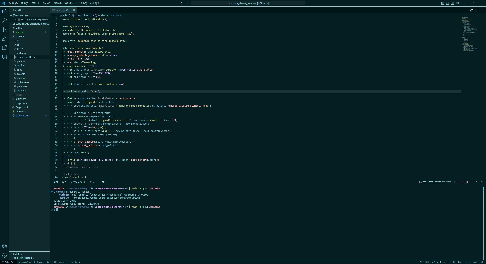
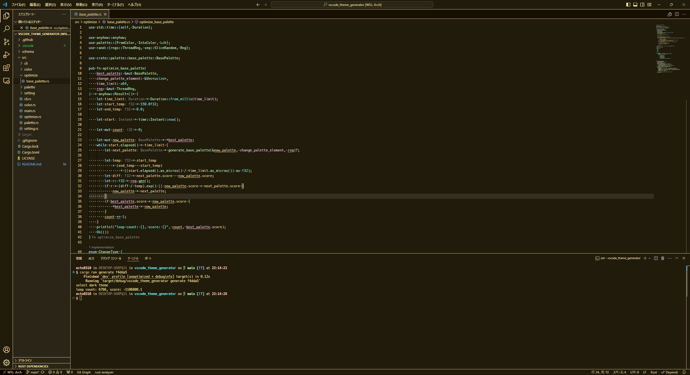
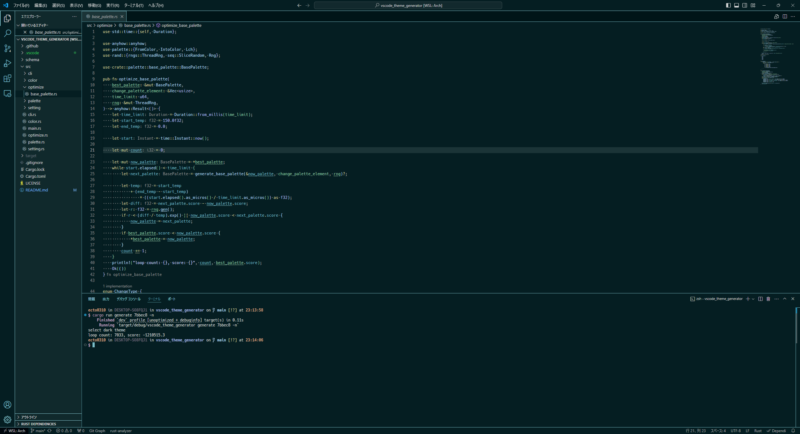
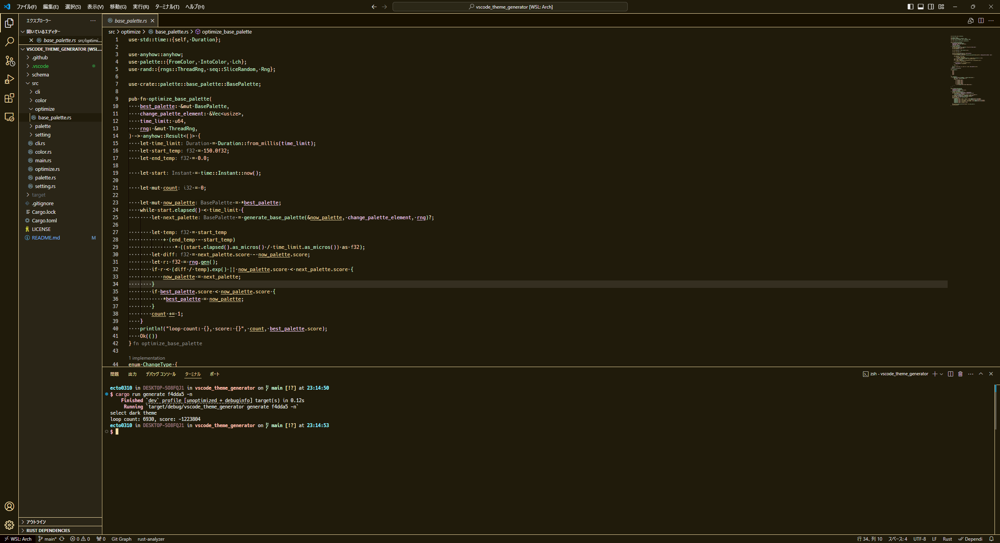

# VSCode Theme Generator

This is a tool to assist in the creation of VSCode themes.
Just specify one color and the theme is automatically created.

## DEMO

|#7bbec8|#f4dda5|
|---|---|
|||
|||

# Usage

```bash
git clone https://github.com/ecto0310/vscode_theme_generator
cargo run --release generate <your favorite color hex>

# color_id is palette.json's key
# anually modify palette.json and run without the -f option
cargo run --release regenerate -f <color_id>
cargo run --release regenerate -f <color_id> -f <color_id>
```
